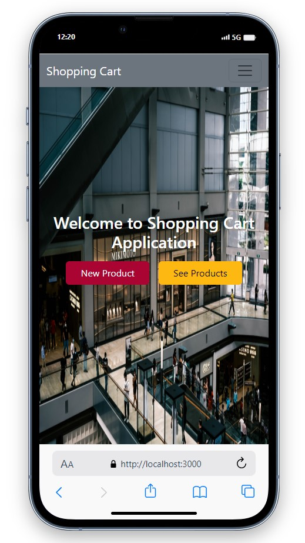
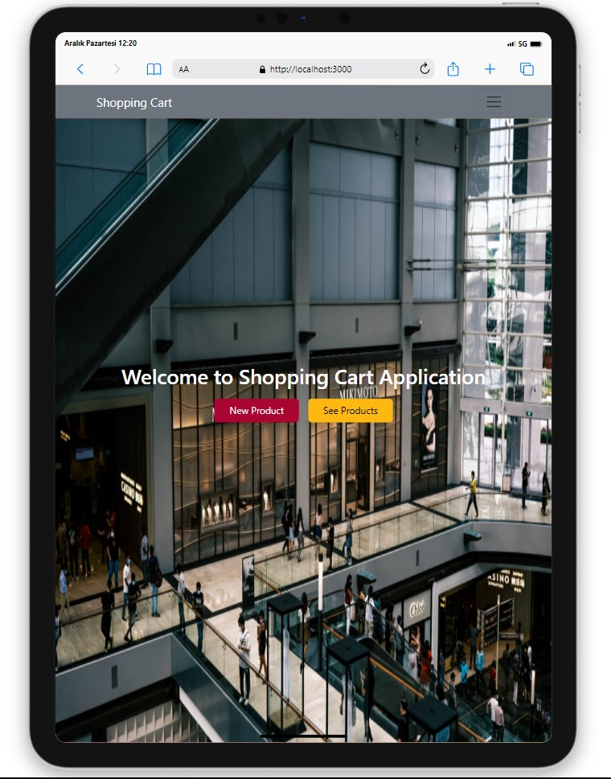
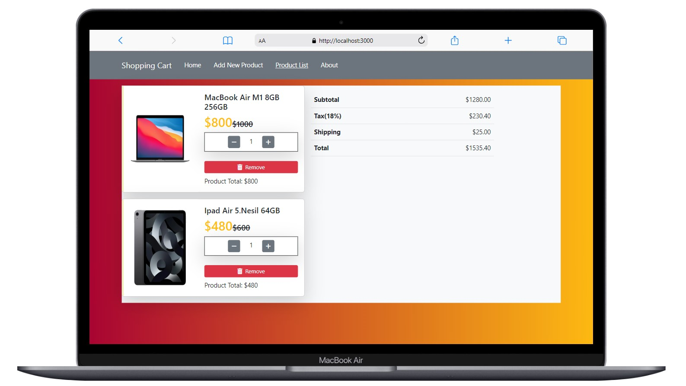

# Shopping Cart

<div align="center">
  
</div>

## About the Project

This project I created with React includes a mock API used for simulating a shopping cart. This API simulates basic shopping operations such as listing products, adding items to the cart, and removing items from the cart.

## Live Demo

[Shopping Cart](https://shopping-cart-gamma-snowy.vercel.app/)

## Features

- Add any product you want to the shopping cart.
- Delete any product from the cart.
- Update any product in the cart.

## Technologies Used

- React
- React Router Dom
- [React Bootstrap](https://react-bootstrap.netlify.app/)
- [Bootstrap](https://getbootstrap.com/)
- Axios for API requests
- [Mockapi](https://mockapi.io/) for data
- Icons from [Font Awesome](https://fontawesome.com/icons)
- Styling with CSS

## Project Skeleton

```
Shopping Cart (folder)
|
|----readme.md         
SOLUTION
├── public
│     └── index.html
├── src
│   ├── App.js
│   ├── assets
│   │    └── [image]
│   ├── components
│   │    ├── CardTotal.jsx
│   │    ├── Navbar.jsx
│   │    ├── ProductCard.jsx
│   │    └── ProductForm.jsx
│   ├── index.css
│   ├── index.js
│   ├── router
│   │    └── router.js
│   └── pages
│        ├── About.jsx
│        ├── Main.jsx
│        ├── NewProduct.jsx
│        ├── ProductList.jsx
│        └── UpdateProduct.jsx
├── package.json
└── yarn.lock

```


## Screenshots

<div align="center">
  
  
  
</div>

## Compatibility

The project is compatible with both wide-screen computers and mobile devices.
